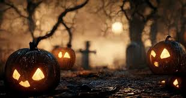
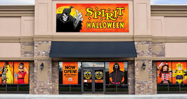
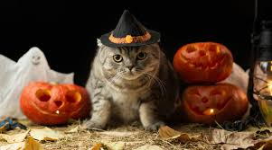

# 517-simon-halloweenstore

all about halloween stores

## What is Halloween

[Halloween](https://www.history.com/articles/history-of-halloween) is a beautiful holiday celebrated by Americans and scary movie lovers everywhere. It had religious roots but it has since been capitalized for our benefit. We celebrate with dress-up, candy, and games. To get ready for the holiday season, let's get to know the most important first step: **what to wear!**

## What to Find at the Stores

### Clothes

#### Human Clothes

There are many items to choose from. If you would like to become non-human (or pose as a human in costume...) here are your options:

- Wizard of Oz Tin Man
- Catwoman
- A Bat
- The Creature from the Lagoon
- Daphne or Scooby Doo
- Inflatable Dino

### Masks

We all wear masks. On our way to work, after that argument with the lady coincidently named Karen in the grocery line, in front of your kid who put the floor gum back into their mouth after you told them several times not to... or several other relatable examples.

Masks You Don't Have to Fake:
- Paper Bag Man
- Scream
- Kitty Kat
- Monkey Face (aka the Karen from the store)
- Jim Carrey's *the mask* mask

### Accessories

Accesorize your life, girl! Spirit Halloween has all you need for that wild night in the neighborhood.

How to get to [Spirit Halloween](https://www.spirithalloween.com/):

1. get in car
2. drive around town with that one friend that never has anything going on either
3. find the old abandoned Kohls
4. Like magic, the halloween store has appeared!
5. go inside girl!

## Pop-Up Store Culture

Malls everywhere have that one abandoed store. This is the perfect site for the latest, month-long spooky new haunt. Take your buddies and try on stuff you'll never buy for hours. Or better yet, buy something you'll only wear once and never use again (or, worse than the curse of the late superstore attendant, you'll be known next year as "that dad")

## Conclusion

Halloween Stores are a strong source of American pride, history, and our right to making Halloween *our* holiday. So celebrate the countdown to this hot shopping splurg!

